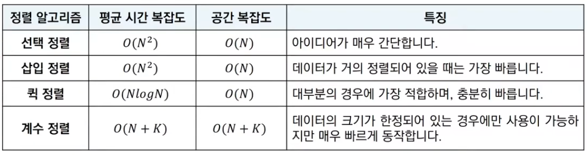

# 정렬 (Sorting)
- 데이터를 특정한 기준에 따라 순서대로 나열하는 것
- 일반적으로 문제 상황에 따라서 적절한 정렬 알고리즘이 공식처럼 사용된다.

<br/>
<br/>

## 선택 정렬
- 처리되지 않은 데이터 중에서 가장 작은 데이터를 선택해 맨 앞에 있는 데이터와 바꾸는 것을 반복
- 동작 예시
    ``` bash
    1. 정렬할 데이터 준비
    2. 가장 작은 데이터 선택해 가장 앞의 데이터와 바꿈
    3. 처리되지 않은 데이터 중 가장 작은 데이터 선택
    4. 2번 과정을 계속 반복
    5. 마지막 데이터는 해당 위치에 그냥 위치 (바꾸지 않음)
    ```
- 시간 복잡도
    - N번 만큼 가장 작은 수를 찾아서 맨 앞으로 보내야 함
    - 반복문이 두 번 중첩되어 사용
    - O(N^2)

<br/>
<br/>

## 삽입 정렬
- 처리되지 않은 데이터를 하나씩 골라 적절한 위치에 삽입
- 선택 정렬에 비해 구현 난이도가 높은 편이지만, 일반적으로 더 효율적으로 동작
- 동작 예시
    ``` bash
    1. 첫 번째 데이터가 정렬되었다고 판단하고 두번째 데이터가 어떤 위치로 들어갈지 판단 (왼쪽 혹은 오른쪽)
    2. 다음 데이터가 어떤 위치로 들어갈지 판단
    3. 계속 왼쪽 데이터와 비교해서 작다면 위치를 변경하고 아니면 그대로 두기
    4. 2~3 과정을 계속 반복함
    ```
- 시간 복잡도
    - O(N^2)
    - 반복문이 두 번 중첩되어 사용
    - 현재 리스트의 데이터가 거의 정렬되어 있는 상태라면 매우 빠르게 동작
        - 최선의 경우 O(N)의 시간복잡도를 가짐

<br/>
<br/>

## 퀵 정렬
- 기준 데이터를 설정하고 그 기준보다 큰 데이터와 작은 데이터의 위치를 바꾸는 방법
- 일반적인 상황에서 가장 많이 사용되는 정렬 알고리즘 중 하나
- 가장 기본적인 퀵 정렬은 첫 번째 데이터를 기준 데이터(Pivot)으로 설정
- 동작 예시
    ``` bash
    1. pivot 데이터 선택
    2. 왼쪽에서부터 피벗보다 큰 데이터 선택, 오른쪽에서부터 피벗보다 작은 데이터 선택
    3. 두 데이터의 위치를 변경
    4. 위치가 엇갈리는 경우 '피벗'과 '작은 데이터'의 위치를 서로 변경
    5. 피벗을 기준으로 데이터 묶음을 나누는 작업을 분할이라고 함
    6. 재귀적으로 수행
    ```
- 시간 복잡도
    - 평균의 경우 O(NlogN)
    - 최악의 경우 O(N^2)


<br/>
<br/>

## 계수 정렬
- 특정한 조헙이 부합할 떄만 사용할 수 있지만 매우 빠르게 동작하는 정렬 알고리즘
- 데이터의 크기 범위가 제한되어 정수 형태로 표현할 수 있을 때 사용 가능
- 데이터의 개수가 N, 데이터(양수) 중 최댓값이 K일 때 최악의 경우에도 수행 시간 `O(N + K)`를 보장한다
- 동작 예시
    ```bash
    1. 가장 데이터부터 가장 큰 데이터의 범위까지 모두 담길 수 있도록 리스트 생성
    2. 데이터를 하나씩 확인하여 데이터의 값과 동일한 인덱스의 데이터를 1씩 중가시킴
    3. 최종 리스트에는 각 데이터가 몇 번씩 등장했는지 그 횟수가 기록된다
    4. 결과 확인 시 첫번째 데이터만큼 하나씩 그 값만큼 반복하여 인덱스를 출력
    ```
- 시간 복잡도와 공간 복잡도는 모두 `O(N+K)`
- 때에 따라서 심각한 비효율성을 초래할 수 도 있다
- 동일한 값을 가지는 데이터가 여러 개 등장할 때 효과적으로 사용 가능

<br/>
<br/>

## 정렬 알고리즘 비교
